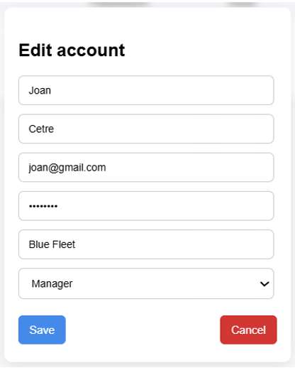
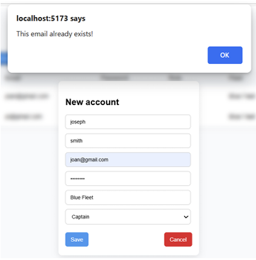
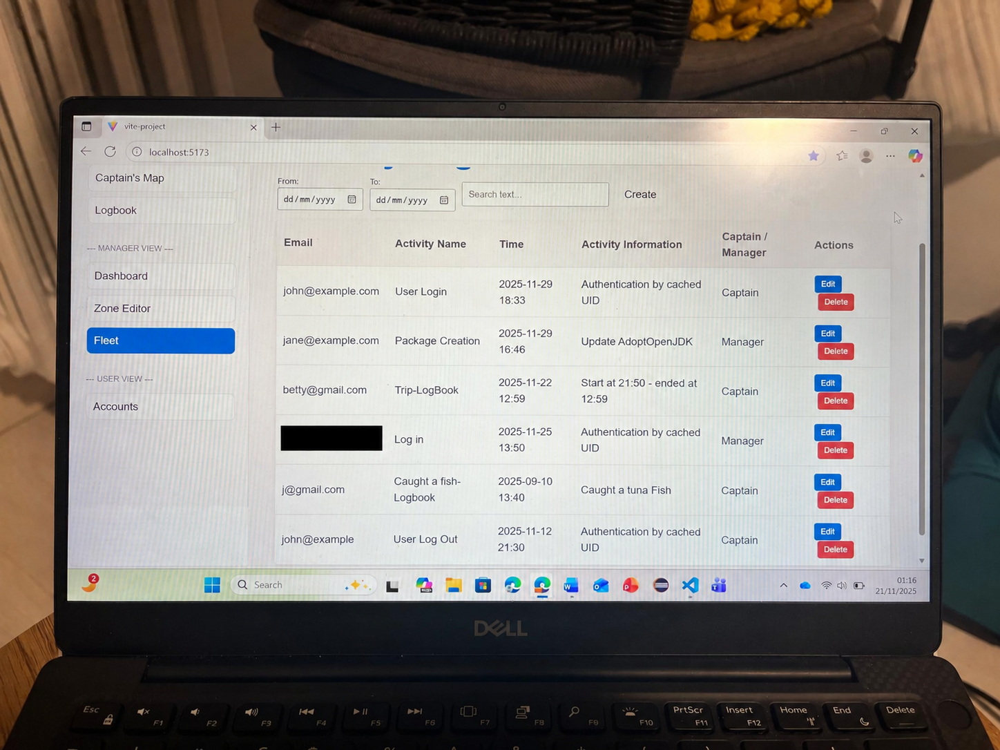
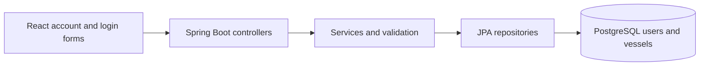

# OceanSense — My Contribution

**React · TypeScript · Java / Spring Boot · PostgreSQL · Team delivery**

OceanSense is a university group application designed to help vessel captains and fleet managers record fishing activity and understand marine restrictions. The project supports the aims of UN Sustainable Development Goal 14: Life Below Water.

My contribution centred on **user accounts, vessel management and login**, connecting the React interface to a Spring Boot API and PostgreSQL database. I also helped coordinate the team as Scrum Master during Sprints 1 and 3.

## My role within the team

| Area | My contribution |
| --- | --- |
| Frontend | Account creation and editing forms, account search, input validation, role selection and vessel assignment |
| Backend | User and vessel models, repositories, services and CRUD endpoints; login credential checks |
| Data integrity | Duplicate-email checks, case-insensitive vessel-name checks and validation of vessel references |
| Password handling | BCrypt hashing and matching; write-only password fields excluded from API responses |
| Integration | Connected UI actions to asynchronous API calls, aligned JSON and TypeScript models, and worked through CORS and integration issues |
| Collaboration | Planned sprint tasks, facilitated meetings, shared progress and tutor guidance, and pair-programmed integration work |

The wider team's work included the captain's map and geofencing, electronic logbook, trip tracking and analytics dashboard. Those features provide the project context; this page focuses on my own module and integration contributions.

## Account management in practice

### Editing an account

My account form supports editing user details and selecting a role. The screenshot shows an earlier frontend version with a fleet field; the integrated implementation uses vessel records and assignments. The masked field protects on-screen visibility; backend password hashing is a separate part of the implementation.

### Handling duplicate email addresses

The interface checks for an existing email before saving and displays feedback when the address is already used. The backend also checks email uniqueness rather than relying solely on the browser.

### Early interface prototype

View the early activity-table prototype

An early development view with sample activity records, search/date controls and edit/delete actions. This is prototype context, not evidence that every displayed activity or authentication mechanism was implemented. A personal email has been covered using an image-editing tool; the two account screenshots above are unaltered.

## How my module fits together

The frontend sends requests and updates its state after successful responses. Controllers handle HTTP requests, services validate data and manage password checks, and repositories persist user and vessel records. Multiple users can be assigned to one vessel.

## Challenges and decisions

| Challenge | What I did and learned |
| --- | --- |
| Frontend/backend data mismatch | Aligned JSON field names and TypeScript interfaces; learned to agree data contracts before integration |
| Password handling | Replaced early plaintext handling with BCrypt hashing and password matching; excluded passwords from API responses |
| Duplicate and invalid records | Checked email uniqueness and vessel references; returned errors that the frontend could display |
| Integration conflicts | Pair-programmed with a teammate to resolve routing and module integration problems |
| Coordinating delivery | Broke work into sprint tasks, tracked progress and clarified requirements with the team |

## Validation and current limitations

During development I used Thunder Client to exercise user and vessel endpoints. My individual report records successful user retrieval, creation and deletion, plus vessel creation and retrieval. The screenshots on this page demonstrate the account interface and duplicate-email feedback; they are not a record of a new automated test run.

This remains an academic prototype. Login credential checking and role-dependent views are implemented, but the reviewed backend configuration permits all requests. Server-side authorisation, robust session management and automated regression tests are important next steps before deployment. I do not describe the prototype as production-ready access control.

## What I gained

- Experience taking a feature from requirements and interface design through database modelling, API development and integration.
- Practice explaining technical decisions, coordinating work, resolving integration problems and supporting teammates throughout delivery.

## About this repository

This is a portfolio case study with selected screenshots. The original university group repository remains private; shared source code, credentials and individual assessment reports are not included here.
